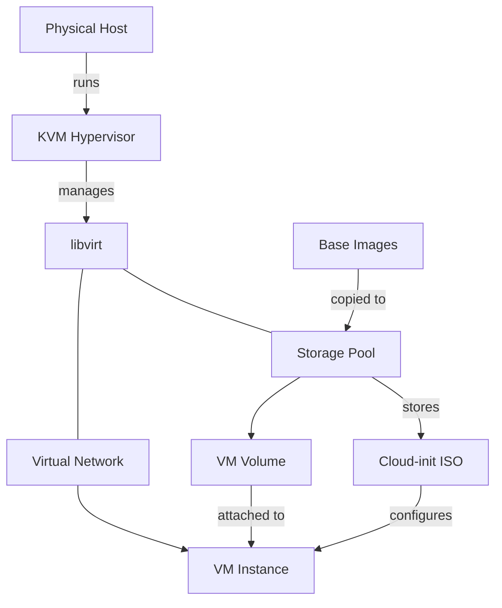
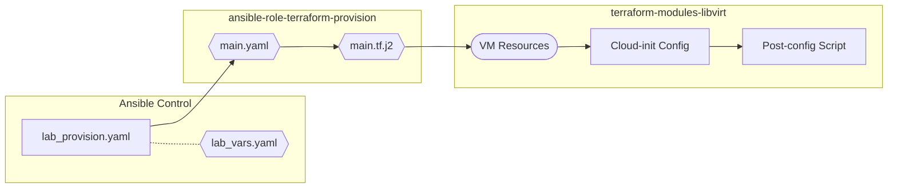
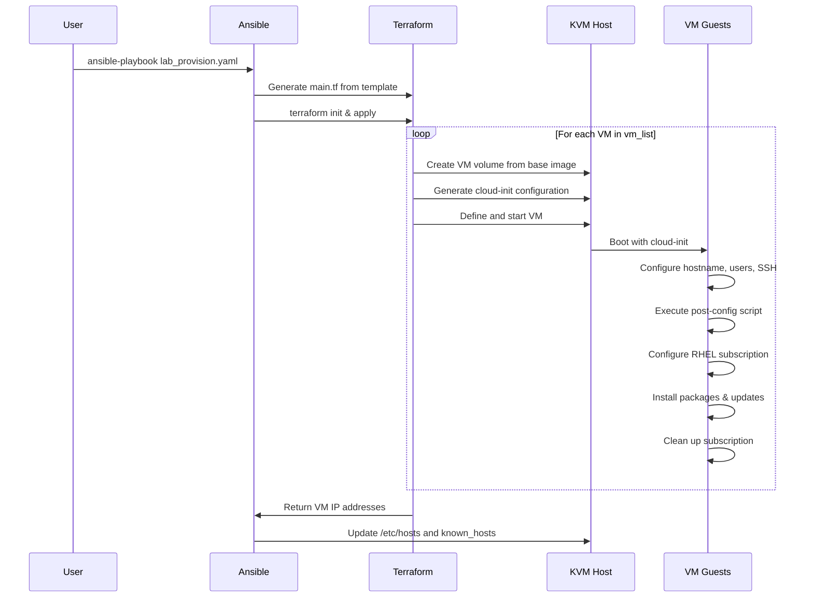

# Lab Provision - Terraform


<!-- @import "[TOC]" {cmd="toc" depthFrom=2 depthTo=6 orderedList=false} -->

<!-- code_chunk_output -->

- [Description](#description)
- [🏗️ Architecture](#️-architecture)
  - [🖥️ Infrastructure](#️-infrastructure)
  - [🧩 Role Structure](#-role-structure)
  - [🔄 Execution Flow](#-execution-flow)
- [🚀 Quick Setup](#-quick-setup)
- [📦 Dependencies](#-dependencies)
  - [Ansible Role: ansible-role-terraform-provision](#ansible-role-ansible-role-terraform-provision)
  - [Terraform Module: terraform-modules-libvirt](#terraform-module-terraform-modules-libvirt)
- [⚙️ Configuration](#️-configuration)
  - [🖥️ VM Specifications](#️-vm-specifications)
  - [🔧 Post-Provisioning Features](#-post-provisioning-features)
  - [🌐 Network Configuration](#-network-configuration)
- [🔀 Differences from lab_provision](#-differences-from-lab_provision)
- [📋 Prerequisites](#-prerequisites)

<!-- /code_chunk_output -->


---

## Description

**lab-provision-terraform** is an Ansible project that creates labs by provisioning and configuring virtual machines on RHEL-like hosts using Terraform and the KVM hypervisor.

**Credits:**
This project extends the [lab-provision-native](https://github.com/chouaieb-sleimi/lab-provision-native.git) concept by using Terraform modules instead of native Ansible libvirt tasks for VM provisioning.


---

## 🏗️ Architecture

### 🖥️ Infrastructure



### 🧩 Role Structure

This project uses Ansible to orchestrate Terraform for VM provisioning:

- **ansible-role-terraform-provision:** Terraform orchestration
- **terraform-modules-libvirt:** VM provisioning and configuration



### 🔄 Execution Flow



---

## 🚀 Quick Setup

1. **Clone the repository:**

   ```bash
   git clone https://github.com/chouaieb-sleimi/lab-provision-terraform.git
   cd lab-provision-terraform
   ```

2. **Install the roles:**

   ```bash
   ansible-galaxy role install -r roles/requirements.yaml -p roles/
   ```

3. **Configure variables:** Edit `lab_vars.yaml` with your VM specifications

4. **Configure inventory:**

   ```ini
   [vm_hosts]
   localhost ansible_connection=local
   ```

5. **Launch the playbook:**

   ```bash
   ansible-playbook -i inventory/inventory --ask-become-pass lab_provision.yaml
   ```

---

## 📦 Dependencies

### Ansible Role: ansible-role-terraform-provision

Orchestrates Terraform to provision VMs using the terraform-modules-libvirt module.
Role repository: [chouaieb-sleimi/ansible-role-terraform-provision](https://github.com/chouaieb-sleimi/ansible-role-terraform-provision)

**Features:**

- Generate Terraform configuration from Ansible variables
- Execute Terraform init and apply
- Add VM hostnames to host's `/etc/hosts` file
- Update `known_hosts` file (avoids SSH fingerprint errors)

**Variables:** See `lab_vars.yaml` for all configuration options

### Terraform Module: terraform-modules-libvirt

Provisions guest VMs with cloud-init and post-provisioning configuration.
Module repository: [chouaieb-sleimi/terraform-modules-libvirt](https://github.com/chouaieb-sleimi/terraform-modules-libvirt.git)

**Features:**

- **VM provisioning:** Create VMs using libvirt with cloud-init
- **Post-provisioning configuration:** SSH keys, RHEL subscriptions, package management
- **Network configuration:** DHCP or static IP assignment

**Variables:** See `lab_vars.yaml` for all configuration options

---

## ⚙️ Configuration

### 🖥️ VM Specifications

Configure your VMs in `lab_vars.yaml`:

```yaml
vm_list:
  - vm_name: "control-rhel-9.3"
    hostname: "control"
    base_image_name: "rhel-9.3-x86_64-kvm.qcow2"
  - vm_name: "managed_1-alma9.1"
    hostname: "managed1"
    base_image_name: "AlmaLinux-9-GenericCloud-9.1-20221118.x86_64.qcow2"
```

### 🔧 Post-Provisioning Features

- **SSH key configuration:** Automatic SSH key deployment
- **Package management:** Install essential packages
- **RHEL subscriptions:** Automatic registration and cleanup
- **System updates:** Optional system package updates
- **DNF optimization:** Performance improvements

### 🌐 Network Configuration

- **Default:** DHCP assignment
- **Static IP:** Configure in terraform-modules-libvirt variables
- **Custom networks:** Specify libvirt network name

---

## 🔀 Differences from lab_provision

| Feature | lab_provision | lab_provision_terraform |
|---------|---------------|------------------------|
| **Provisioning** | Native Ansible libvirt | Terraform + libvirt |
| **Configuration** | Separate Ansible role | Integrated cloud-init + shell script |
| **State Management** | Ansible facts | Terraform state |
| **Modularity** | Ansible roles | Terraform modules |
| **Scalability** | Sequential execution | Terraform parallelization |

---

## 📋 Prerequisites

- **KVM/QEMU** installed and running
- **libvirt** service active
- **Terraform** >= 1.0 installed
- Base VM images in **QCOW2 format**
- **Ansible** with required collections